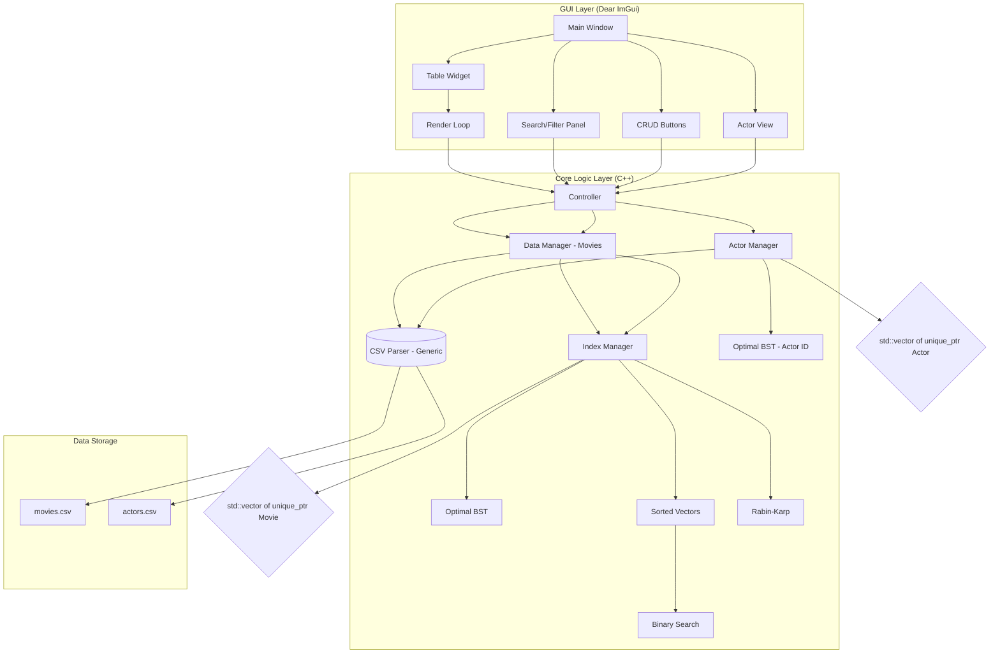

# Дизайн документ "Фильмотека"

## 1. Введение и контекст

- **Краткое описание:**
Десктопное приложение для ведения персонального каталога фильмов и актёров. Пользователь может добавлять, редактировать и удалять записи, а также эффективно искать и сортировать их с помощью реализованных структур данных (деревья оптимального поиска, быстрая сортировка, бинарный поиск, алгоритм Рабина-Карпа) без использования сторонних библиотек для хранения и индексации.
- **Бизнес-цель:**
Создать легковесный, быстрый и полностью контролируемый инструмент для организации личной коллекции фильмов с упором на производительность.
- **Текущий статус (AS-IS):**
    - Проект находится на этапе **инициации и планирования**.
    - Проведено предварительное обсуждение требований к функциональности приложения.
    - Рассматриваются и сравниваются различные технические решения:
        - Выбор графического фреймворка (Dear ImGui как основной кандидат).
        - Проектирование самописных структур данных (деревья оптимального поиска для индексации).
        - Определение формата хранения данных (CSV).
    - Формируется общая архитектура проекта и распределение ответственности между компонентами.
    - **Организационная структура команды:**
        - В настоящий момент происходит распределение ролей и зон ответственности между участниками (например: разработка ядра/алгоритмов, разработка GUI, интеграция, тестирование).
        - Настраивается репозиторий и система контроля версий (Git).
        - Создается первоначальная структура проекта (директории, CMakeLists.txt).
- **Целевой статус (TO-BE):**
    - Приложение с графическим интерфейсом на **Dear ImGui**.
    - Данные загружаются из CSV-файлов при старте и автоматически сохраняются при каждом изменении.
    - Поддержка множественных таблиц данных (фильмы, актёры) с возможностью расширения без дублирования кода.
    - Вся работа с данными в памяти осуществляется через самописные структуры:
        - **Деревья оптимального поиска** для индексации по ключевым полям (название, год, студия) для поиска за O(log n).
        - **Быстрая сортировка (Хоара)** для сортировки отображаемого списка по рейтингу.
        - **Бинарный поиск** для выборки фильмов по диапазонам рейтинга и длительности.
        - **Алгоритм Рабина-Карпа** для полнотекстового поиска по описанию.
    - Пользователь имеет полный контроль над записями (CRUD) через удобный интерфейс.

---

## 2. Функциональные требования

### Use Cases (Сценарии использования)

1. **Просмотр каталога:**
    - При запуске приложение автоматически загружает данные из `movies.csv` и `actors.csv`, строит индексы (деревья оптимального поиска) и отображает все фильмы в табличном виде.
2. **Добавление фильма:**
    - Пользователь нажимает кнопку "Добавить", заполняет поля (включая жанры) в появившемся окне и подтверждает ввод.
    - Новый фильм добавляется в основной вектор и во все индексы.
    - Данные автоматически сохраняются в CSV.
3. **Редактирование фильма:**
    - Пользователь выбирает фильм в таблице и нажимает "Редактировать".
    - После изменения данных запись обновляется в векторе, индексы перестраиваются, данные сохраняются в CSV.
4. **Удаление фильма:**
    - Пользователь выбирает фильм и нажимает "Удалить".
    - Запись удаляется из вектора, индексы перестраиваются, данные сохраняются в CSV.
5. **Сортировка:**
    - Пользователь нажимает на заголовок столбца "Рейтинг".
    - Бэкенд сортирует текущий массив фильмов **алгоритмом быстрой сортировки (Хоара)**.
    - Указатель на отсортированный массив указателей помещается в кэш отсортированных массивов для конкретного ключа (ленивая инициализация). При последующем обращении к тому же ключу сортировки будет использоваться закэшированный массив. Кэш сбрасывается при любом изменении данных (добавлении, удалении, редактировании).
    - Отсортированные данные отображаются в интерфейсе.
6. **Поиск и фильтрация:**
    - Пользователь вводит запрос в поисковую строку. Поиск может происходить как по мере ввода, так и по нажатию кнопки "Найти".
    - **Точный поиск по ключу:** Если выбран ключ (название, студия, год), бэкенд выполняет поиск по соответствующему **дереву оптимального поиска**, находя записи, где ключ начинается с введенной строки.
    - **Полнотекстовый поиск:** Если выбран режим поиска по описанию, бэкенд применяет **алгоритм Рабина-Карпа** для нахождения всех фильмов, содержащих искомую подстроку в поле `description`.
    - **Фильтрация по диапазону:** Для полей рейтинга и длительности пользователь может задать нижнюю и верхнюю границы. Бэкенд использует **бинарный поиск** по предварительно отсортированным массивам для быстрого отбора фильмов, попадающих в диапазон.
    - **Фильтрация по жанру:** Пользователь выбирает жанр из доступных. Бэкенд фильтрует фильмы, содержащие выбранный жанр в своём списке жанров.
7. **Просмотр актёров:**
    - Пользователь может просмотреть список актёров, загруженных из `actors.csv`.
    - При клике на actorId в карточке фильма отображается информация об актёре (имя, описание, дата рождения, фото, список фильмов).
    - Актёры индексируются по id через дерево оптимального поиска для быстрого доступа.
    - Поиск по актёрам не предусмотрен.
8. **Автоматическое сохранение данных:**
    - При любом изменении данных (добавление, удаление, редактирование) текущее состояние автоматически сохраняется в соответствующий CSV-файл.

### Границы проекта (Scope)

- **Делаем:**
    - Реализация кастомного дерева оптимального поиска для индексации по ключам типа `int`, `double`, `std::string`.
    - Реализация алгоритма быстрой сортировки для вектора указателей на фильмы.
    - Реализация бинарного поиска для работы с диапазонами.
    - Реализация алгоритма Рабина-Карпа для поиска подстроки в описании.
    - Хранение данных в векторе `std::vector<std::unique_ptr<Movie>>` и работа с ними через сырые указатели в индексах.
    - Поддержка множественных таблиц данных (Movie, Actor) с обобщённым CSV-парсером.
    - Графический интерфейс на **Dear ImGui**.
    - Импорт/экспорт в CSV-файлы.
    - Автоматическое сохранение при любом изменении данных.
- **НЕ делаем:**
    - Сетевого взаимодействия (парсинг сайтов, API).
    - Сложной многопоточности.

---

## 3. Нефункциональные требования

- **Производительность:**
    - Поиск по любому ключу через дерево оптимального поиска за O(log n).
    - Фильтрация по диапазону через бинарный поиск за O(log n + k), где k - размер результата.
    - Сортировка списка через QuickSort со средней сложностью O(n log n).
    - Запуск приложения моментальный, инициализация базы данных происходит после инициализации GUI.
- **Надежность:**
    - Приложение не должно аварийно завершаться.
    - Корректная обработка ошибок формата CSV.
    - Отсутствие утечек памяти
    - Автоматическое сохранение гарантирует сохранность данных при сбоях.
- **Удобство использования:**
    - Понятный интерфейс: таблица с данными, строка поиска, кнопки управления записями.
    - Интуитивные модальные окна для добавления/редактирования.
    - Фильтрация по жанрам через выпадающий список / чекбоксы.
- **Расширяемость:**
    - Архитектура позволяет добавлять новые таблицы данных (сущности) без серьёзного переписывания кода и без дублирования логики CSV-парсинга.

---

## 4. Логика и API (Взаимодействие GUI и Бэкенда)

Взаимодействие строится на прямых вызовах методов ядра приложения из коллбэков, привязанных к элементам интерфейса.

### Модели данных (C++)

```c
struct Movie
{
    int id; // Уникальный ID (автоинкремент, сохраняется в CSV).
    std::string title;
    std::string studio;
    std::string description;
    int year;
    int length; // Длительность в секундах.
    double rating;
    std::string cover; // Путь к файлу обложки или ссылка (опционально).
    std::string streamLink; // Ссылка на hls ссылку или путь к файлу (опционально).
    std::vector<std::string> genres; // Список жанров фильма.
    std::vector<int> actorIds; // ID актёров из таблицы Actor.
};

struct Actor
{
    int id; // Уникальный ID (автоинкремент, сохраняется в CSV).
    std::string name; // Имя (ФИО).
    std::string description; // Описание.
    long int birthdate; // UNIX timestamp.
    std::set<int> filmIds; // Уникальные идентификаторы фильмов.
    std::string photo; // Явный путь либо ссылка на фотографию.
};

// Основное хранилище фильмов (единственный владелец объектов Movie)
std::vector<std::unique_ptr<Movie>> movies;

// Основное хранилище актёров (единственный владелец объектов Actor)
std::vector<std::unique_ptr<Actor>> actors;

// Индексы (деревья оптимального поиска), хранящие СЫРЫЕ указатели.
OptimalBST<Movie, std::string> titleIndex;
OptimalBST<Movie, std::string> studioIndex;
OptimalBST<Movie, int> yearIndex;
OptimalBST<Actor, int> actorIdIndex;  // Индекс актёров по ID для быстрого доступа.

// Для фильтрации по рейтингу и длительности используются отдельные
// отсортированные векторы сырых указателей, по которым затем выполняется бинарный поиск.
std::vector<Movie*> sortedByRating;
std::vector<Movie*> sortedByLength;

// Для полнотекстового поиска по описанию применяется алгоритм Рабина-Карпа.
```

---

## 5. Архитектура и технологический стек

### Схема решения (High-Level Design)



### Выбор технологий и обоснование

- **Язык: C++**
    - Максимальная производительность.
    - Полный контроль над памятью при реализации деревьев и сортировки.
    - Наличие STL (`std::vector`, `std::unique_ptr`).
- **GUI: Dear ImGui**
    - **Обоснование выбора:** Идеально подходит для инструментов с кастомной логикой отображения данных.
    - Позволяет быстро создавать интерфейс с таблицами и кнопками.
    - Кроссплатформенность.
    - Простота отрисовки динамических списков и таблиц.
- **Хранение: CSV**
    - Простота парсинга и генерации.
    - Человекочитаемый формат.
    - Не требует внешних зависимостей.
    - Отдельные CSV-файл для каждой таблицы (movies.csv, actors.csv).
- **Алгоритмы и структуры данных (самописные):**
    - **Дерево оптимального поиска:** Обеспечивает гарантированное время поиска O(log n). Реализуется вручную для понимания принципов балансировки и эффективного использования указателей.
    - **Быстрая сортировка (Хоара):** Алгоритм сортировки с отличной средней производительностью O(n log n). Реализуется вручную, может быть оптимизирована (выбор опорного элемента, переход на сортировку вставками для малых подмассивов).
    - **Бинарный поиск:** Используется для высокопроизводительной фильтрации по диапазонам числовых значений (рейтинг, длительность).
    - **Алгоритм Рабина-Карпа:** Применяется для эффективного полнотекстового поиска по описанию, минимизируя количество сравнений строк.

---

## 6. Работа с данными

- **Загрузка:**
    - При запуске приложение пытается открыть `movies.csv` и `actors.csv`.
    - Построчно парсит файлы с учетом экранирования через обобщённый CSV-парсер.
    - Для каждой успешно распарсенной строки создается объект в куче, указатель на него сохраняется в соответствующем векторе и вставляется во все индексы.
    - ID читается из CSV-файла. При добавлении новых записей используется автоинкремент (max(id) + 1).
- **Сохранение:**
    - Происходит автоматически при любом изменении данных (добавление, удаление, редактирование).
    - Файл перезаписывается полностью при каждом сохранении.
- **Консистентность данных:**
    - У каждого фильма и актёра есть уникальный `id`, который сохраняется в CSV.
    - При любом изменении данных все индексы и кэшированные отсортированные массивы перестраиваются.
    - Связь Movie-Actor реализована через `actorIds` в Movie и `filmIds` в Actor.
- **Формат CSV (фильмы):**
    ```
    id,title,studio,description,year,length,rating,cover,streamLink,genres,actorIds
    ```
    - Жанры и actorIds сериализуются через разделитель `|` внутри одного CSV-поля.
- **Формат CSV (актёры):**
    ```
    id,name,description,birthdate,filmIds,photo
    ```
    - filmIds сериализуются через разделитель `|`.

---

## 7. Ошибки и исключения

- **Ошибка чтения CSV:**
    - **Действие:** Если строка не соответствует формату или не удается преобразовать число.
    - **Логика:** Пропустить строку, записать предупреждение в лог, продолжить загрузку. GUI может отобразить всплывающее окно "Обнаружены битые строки, проверьте лог".
- **Ошибка записи CSV:**
    - **Действие:** Не удается открыть файл для записи (нет прав, диск полон).
    - **Логика:** Показать модальное окно с сообщением об ошибке. Данные в памяти не теряются, пользователь может попробовать сохранить снова или выбрать другой файл.

---

## 8. Развертывание (Deployment)

- **Сборка:**
    - Используется **CMake** для генерации проектов.
    - Основные зависимости (Dear ImGui, GLFW) подключаются как **git-субмодули**, что обеспечивает воспроизводимость сборки и контроль версий зависимостей.
- **Структура репозитория:**
    - Проект организован в логические директории: `/src` (исходный код), `/include` (заголовочные файлы), `/third_party` (cторонние зависимости), `/data` (ресурсы и CSV-файлы), `/tests` (юнит-тесты).
- **Распространение:**
    - Статическая сборка всех зависимостей.
    - Один исполняемый файл (например, `FilmLibrary.exe` или `film_library`).
    - В директории `/data` будут создаваться `movies.csv` и `actors.csv` при первом сохранении.
- **Окружение:**
    - Кроссплатформенность (Windows, Linux, macOS).

---

## 9. Тестирование

- **Юнит-тесты:**
    - **Дерево оптимального поиска:**
        - Проверка свойства балансировки после вставки и удаления элементов.
        - Проверка корректности поиска и диапазонного поиска.
    - **QuickSort:**
        - Проверка сортировки различных типов массивов (случайный, отсортированный, пустой, с одним элементом).
    - **Бинарный поиск:**
        - Проверка нахождения элементов в отсортированном массиве и корректной обработки граничных условий.
    - **Алгоритм Рабина-Карпа:**
        - Проверка поиска подстрок в различных строках, включая случаи с коллизиями хэшей.
- **Интеграционные тесты:**
    - Тест CSV: запись и чтение набора фильмов (с жанрами, actorIds, id), сравнение данных до и после операции.
    - Тест CSV: запись и чтение набора актёров, сравнение данных до и после операции.
- **Критерии приемки (Definition of Done):**
    - Реализованы и отлажены все кастомные структуры и алгоритмы.
    - Реализованы все CRUD-операции с поддержанием консистентности индексов.
    - Интерфейс на Dear ImGui позволяет выполнять все Use Cases без вылетов.
    - Данные корректно сохраняются и загружаются из CSV (включая id, жанры, actorIds).
    - Автоматическое сохранение работает при каждом изменении данных.
    - Проект компилируется без ошибок и предупреждений на всех целевых платформах.

---

## 10. Стиль кода и стандарты качества

- **Парадигмы и принципы:**
    - Код должен следовать принципам **объектно-ориентированного программирования** для инкапсуляции данных и поведения.
    - Необходимо соблюдать принципы **Clean Code**: давать переменным, функциям и классам осмысленные имена, писать короткие функции, выполняющие одно действие.
    - Следовать принципам **SOLID** для создания гибкой и расширяемой архитектуры.
        - **S: Single Responsibility Principle** (Принцип единственной ответственности) - каждый объект (класс или модуль) должен отвечать только за одну конкретную функцию.
        - **O: Open-Closed Principle** (Принцип открытости/закрытости) - программные сущности должны быть открыты для расширения, но закрыты для модификации (изменения исходного кода).
        - **L: Liskov Substitution Principle** (Принцип подстановки Барбары Лисков) - объекты в программе должны быть заменяемыми на экземпляры их подтипов без изменения правильности работы программы.
        - **I: Interface Segregation Principle** (Принцип разделения интерфейса) - лучше создавать много специализированных интерфейсов, чем один универсальный; клиенты не должны зависеть от методов, которые они не используют.
        - **D: Dependency Inversion Principle** (Принцип инверсии зависимостей) - модули верхних уровней не должны зависеть от модулей нижних уровней; оба типа модулей должны зависеть от абстракций.
    - Избегать дублирования кода, следуя принципу **DRY (Don't Repeat Yourself)**. Общая логика должна выноситься в отдельные функции или классы.
- **Форматирование и именование:**
    - Открывающая фигурная скобка `{` для пространств имен, классов, функций и управляющих конструкций размещается на **новой строке**.
    - **Переменные и свойства:** именуются в стиле `lowerCamelCase` (например, `movieTitle`, `yearIndex`).
    - **Функции и методы:** именуются в стиле `UpperCamelCase` (например, `FindByTitle`, `LoadFromCsv`).
    - **Классы и структуры:** также именуются в стиле `UpperCamelCase` (например, `OptimalBST`, `Movie`).
    - **Константы и макросы:** именуются в стиле `UPPER_SNAKE_CASE` (например, `MAX_STRING_LENGTH`).
